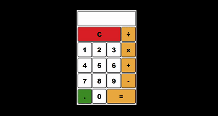

# 1. 계산기 살펴보기 🔎

<p align=center style="color:#b9b9b9">프로젝트 기간 2021.07.06 ~ 2021.07.07</p>

### 🔥 서비스 소개

#### 간단한 계산을 할 수 있는 웹 사이트입니다.

### 💻 기술 스택

- `Javascript`
- `HTML5`
- `CSS3`

> #### ⚙ 프로젝트 실행 해보기

```js
git clone https://github.com/dnr14/calculator.git
cd calculator
npm -g i serve
serve -s .
```

> #### 👨‍💻 구현화면

- [체험하기](https://dnr14.github.io/calculator)

<div align=center>
  
</div>

<br>

### 🔥 기능 설명

1. 계산이 가능한 유효한 식을 만들기 위해서 곱하기, 나누기를 replace를 통해서 계산에 맞는 식을 변경합니다.

```js
while (1) {
  if (inputValue.indexOf("x") === -1) break;
  inputValue = inputValue.replace("x", "*");
}

while (1) {
  if (inputValue.indexOf("÷") === -1) break;
  inputValue = inputValue.replace("÷", "/");
}
```

2. 자바스크립트의 유효범위 -(2^53-1) ~ 2^53+1가 넘는지 체크를 합니다. 계산을 통해서 무한소수가 나오는 경우 소수점 10자리까지 표현하여서 오차를 줄입니다.

```js
if (Number.isInteger(result)) {
  // 자바스크립트는 -(2^53-1) ~ 2^53+1 범위의 정수만 사용할 수 있습니다.
  if (!Number.isSafeInteger(result)) {
    alert("유효한 범위를 넘어버렸습니다.");
    return;
  } else {
    this.$inputEl.value = result;
  }
} else if (Number.isFinite(result)) {
  // 10진수의 소수점을 2진번으로 변환을 하게되면 무한 소수가 나타납니다.
  // 무한한 소수는 컴퓨터에 저장 할 수없으니 유한 소수까지 짤라서 저장을합니다. 짤라진 만큼 계산에 오차가 발생합니다.
  // 이것을 방지하기위해 소수점 10자리까지 표현합니다.
  this.$inputEl.value = result.toFixed(10);
}
```

3. eval 함수의 throw Error를 catch를 이용해서 유효한 식인지 체크를 합니다.

```js
try {
  if (inputValue === "") throw new Error();
  let result = eval(inputValue);
  // ... 생략
} catch (error) {
  this.$inputEl.value = "";
  alert("올바른 계산식이 아닙니다.");
}
```
